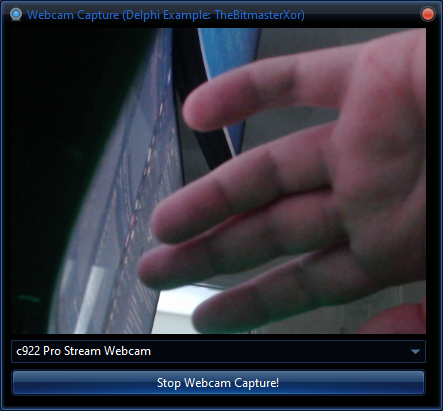

<h1>Webcam Capture Project</h1>

This Delphi VCL application allows users to capture video from a selected webcam. It features an intuitive user interface with a button to start/stop the video capture and a <code>ComboBox</code> to select from available webcam devices. The captured video is displayed in an <code>Image</code> control.

<!-- Replace 'screenshot.png' with the path to your actual image file -->

  

<h2>Features</h2>
<ul>
  <li><strong>Webcam Selection:</strong> Lists all available video capture devices.</li>
  <li><strong>Video Capture:</strong> Start and stop video capture from the selected webcam.</li>
  <li><strong>Preview Mode:</strong> Enables live preview of the webcam feed.</li>
</ul>

<h2>Components</h2>
<ul>
  <li><code>TImage:</code> Displays the video feed from the webcam.</li>
  <li><code>TButton:</code> Starts and stops video capture.</li>
  <li><code>TComboBox:</code> Lists available video capture devices.</li>
</ul>

<h2>Usage</h2>
<ol>
  <li><strong>Start the Application:</strong> Run the application to see the <code>ComboBox</code> populated with available webcams.</li>
  <li><strong>Select a Webcam:</strong> Choose a webcam from the dropdown list.</li>
  <li><strong>Start Capture:</strong> Click the "Start Webcam Capture!" button to begin capturing video.</li>
  <li><strong>Stop Capture:</strong> Click the "Stop Webcam Capture!" button to stop capturing video.</li>
</ol>

<h2>Dependencies</h2>
<ul>
  <li><code>AVICAP32.DLL:</code> Required for video capture functionality. This DLL is typically pre-installed with Windows.</li>
</ul>

<h2>License</h2>

This project is licensed under the MIT License - see the <a href="LICENSE">LICENSE</a> file for details.

